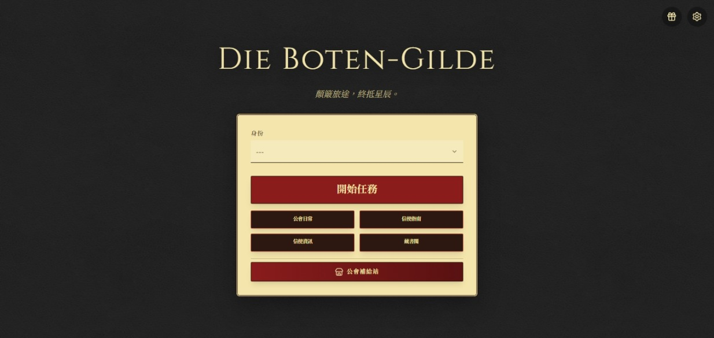
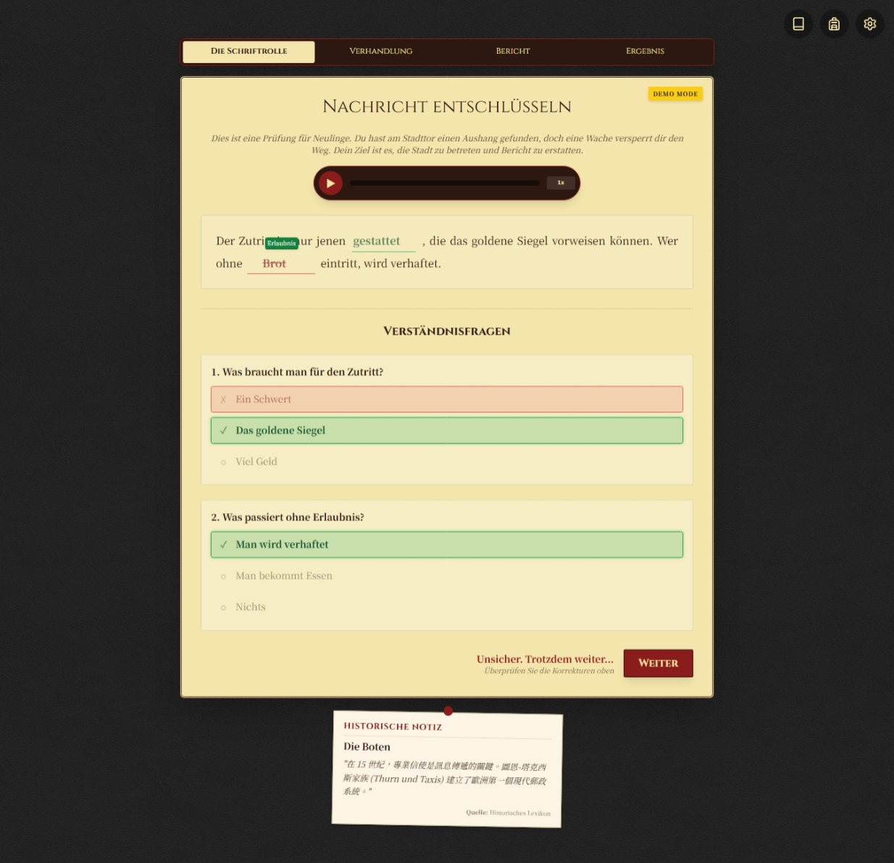
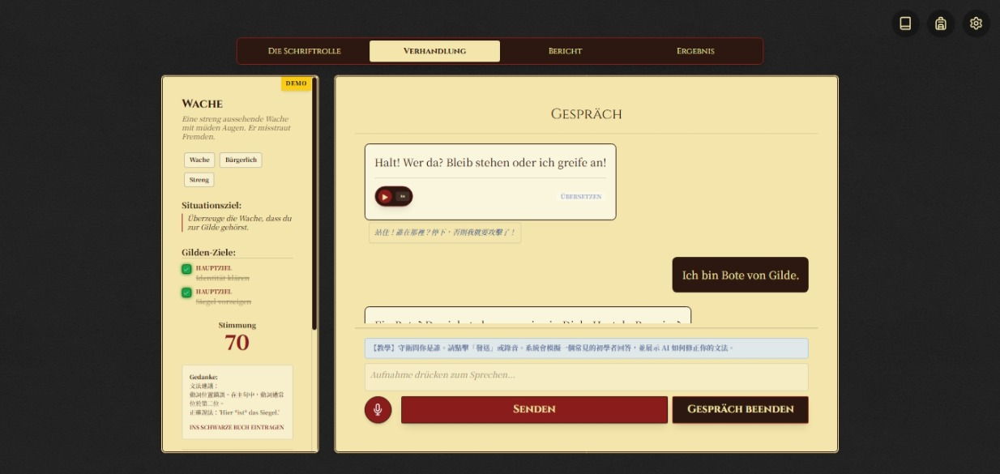
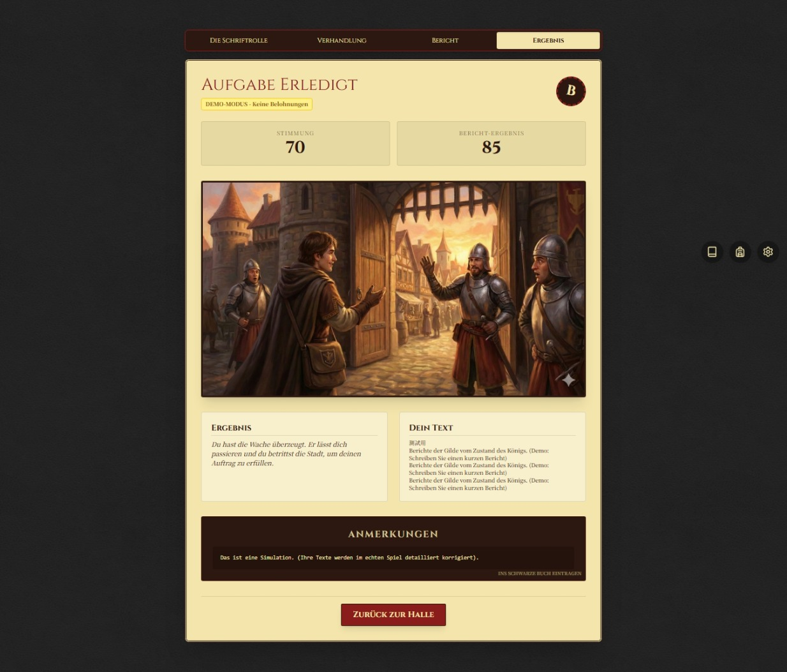

<div align="center">

<!-- 保留原有的 Banner 或自己設計新的 -->


# Die Boten-Gilde (信使公會)

**在歷史冒險中學習德語 | Learn German Through Historical Adventures**

[](https://reactjs.org/)
[](https://www.typescriptlang.org/)
[](https://ai.google.dev/)

[🎮 線上試玩](https://joanneyisyuansie.github.io/Die-Boten-Gilde/) · [📖 技術文件](TECHNICAL.md)

</div>

---

## 📖 關於本專案

**Die Boten-Gilde** 是一款創新的德語學習 RPG 遊戲。你將扮演橫跨西元 800-1900 年歐洲的信使,透過執行歷史任務來學習德語。

> **"Non est ad astra mollis e terris via."**  
> *(通往星辰之路,於平地絕不平坦)*  
> —— 信使公會座右銘

### ✨ 核心特色

- 🎯 **三階段學習系統** - 閱讀理解、口語對話、寫作報告
- 🤖 **AI 驅動內容** - 使用 Google Gemini 生成無限任務變化
- 🎤 **真實口說練習** - 整合語音辨識,在家也能練對話
- 📊 **CEFR 標準分級** - 支援 A1 到 C1 的德語學習者
- 🌍 **中德雙語介面** - 繁體中文/德語自由切換
- 💰 **RPG 收集要素** - 商店系統、身份背景、主題皮膚

---

## 🎮 遊戲畫面

### 主選單

*選擇你的身份背景,開始歷史冒險*

### Level 1 - 解密訊息

*破解德文信件,完成克漏字測驗*

### Level 2 - 對話談判

*與 NPC 進行德語對話,影響信任度*

### Epilogue - 任務評級

*獲得評分、金幣和 AI 生成的任務插圖*

---

## 🎯 遊戲機制

透過三階段任務系統學習德語:
- **📖 解密訊息** - 閱讀理解(克漏字、多選題、聽力)
- **💬 對話談判** - 口語練習(語音輸入、AI 評估、信任度系統)
- **✍️ 撰寫報告** - 寫作練習(文法評分、詞彙分析、修正建議)

提供三種遊戲模式:
- **戰役模式** - 完整歷史任務,獲得金幣和 AI 插圖
- **訓練模式** - 單獨練習,日常對話情境
- **演示模式** - 無需 API Key,快速體驗

> 📖 **詳細機制說明請參考** [技術文件](TECHNICAL.md#遊戲機制)

---

## 🚀 快速開始

### 前置需求

- **Node.js** (建議 v18 以上) - 僅供本機開發
- **Gemini API Key** - [點此免費申請](https://ai.google.dev/)

### 🎮 線上試玩 (推薦)

直接前往 **[https://joanneyisyuansie.github.io/Die-Boten-Gilde/](https://joanneyisyuansie.github.io/Die-Boten-Gilde/)** 開始遊戲!

進入遊戲後:
1. 點選右下角「⚙️ 設定」
2. 輸入你的 Gemini API Key
3. 選擇難度等級和界面語言
4. 開始學習!

### 💻 本機執行 (開發者)

```bash
# 1. 複製專案
git clone https://github.com/JoanneYiSyuanSie/Die-Boten-Gilde.git
cd Die-Boten-Gilde

# 2. 安裝依賴
npm install

# 3. 啟動開發伺服器
npm run dev
```

### 🔑 如何取得 Gemini API Key?

1. 前往 [Google AI Studio](https://ai.google.dev/)
2. 使用 Google 帳號登入
3. 點選「Get API Key」
4. 複製金鑰,在遊戲設定中輸入

> **💡 小提示**: 
> - 免費版 API 每分鐘有請求次數限制
> - 可以先使用「演示模式」體驗遊戲,無需 API Key
> - API Key 儲存在瀏覽器本地,不會上傳到伺服器

---

## 🛠️ 技術架構

### 技術棧

- **前端框架**: React 19.2 + TypeScript 5.8
- **建構工具**: Vite 6.2
- **AI 整合**: Google Gemini API 1.37
- **語音辨識**: 瀏覽器 Web Speech API
- **狀態管理**: React Context
- **資料儲存**: LocalStorage

### 專案結構 (簡化版)

```
die-boten-gilde/
├── components/          # React 組件
│   ├── game/           # 遊戲關卡、商店、Modal
│   └── ui/             # 通用 UI 元件
├── contexts/           # 全域狀態管理
├── services/gemini/    # AI 服務層
├── constants/          # 遊戲資料(NPC、商店、主題)
├── utils/locales/      # 中德語言檔
└── data/dlc/          # DLC 擴充內容
```

> 📚 詳細的技術文件請參考 [TECHNICAL.md](TECHNICAL.md)

---

## 🎨 遊戲特色

### � 完整學習工具
- **字彙手冊** - 選取文字即可儲存單字和例句
- **錯題本** - 自動記錄錯誤,顯示 AI 修正建議
- **任務紀錄** - 回顧歷史成績和故事結局

### 💰 RPG 收集系統
- **商店** - 購買提示道具、評分加成、UI 主題
- **身份背景** - 選擇漢薩商人、貴族子弟等,影響 NPC 信任度
- **DLC 擴充** - 支援自製任務包兌換

### 🎭 動態 NPC 互動
每個 NPC 有獨特的角色、背景、個性和聲音,影響對話難度和初始信任度。

> 📖 **詳細功能說明請參考** [技術文件](TECHNICAL.md#學習輔助功能)

---

## 🌍 多語言支援

- **介面語言**: 繁體中文 🇹🇼 / 德語 🇩🇪
- **學習語言**: 德語
- **輔助翻譯**: 根據介面語言提供提示

---

## 📄 版權聲明

© 2026 JoanneYiSyuanSie. All Rights Reserved.

本專案為個人結業作品,原始碼僅供學習與作品集展示用途。  
未經授權,不得用於商業目的或二次發布。

如有合作或授權需求,歡迎透過 GitHub Issues 聯繫。

---

## 📮 聯絡方式

- **作者**: JoanneYiSyuanSie
- **專案連結**: [https://github.com/JoanneYiSyuanSie/Die-Boten-Gilde](https://github.com/JoanneYiSyuanSie/Die-Boten-Gilde)

---

<div align="center">

**在歷史的長河中,用德語書寫你的傳奇**

Made with ❤️ and ☕ in Taiwan

</div>
